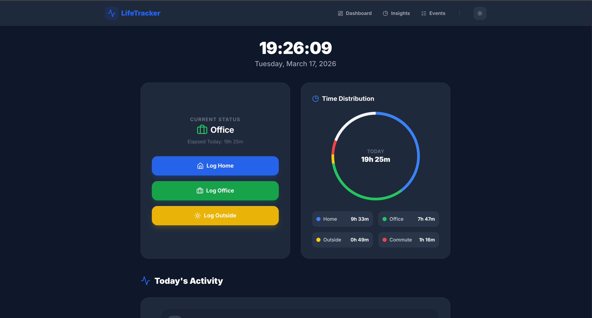

# LifeTracker - Personal Productivity Dashboard

**LifeTracker** is a premium, real-time personal time-tracking application designed to help you visualize your day with precision. It automatically calculates time spent at home, office, and outside, including intelligent commute detection, all within a beautiful, dark-mode-first interface.

```markdown

```

## 🚀 Features

-   **Real-Time Dashboard**: A 24-hour "Today View" featuring a dynamic donut chart and live clock.
-   **Intelligent Commute Detection**: Automatically identifies transitions between Home and Office as "Commute" time.
-   **Activity Timeline**: A detailed, vertical play-by-play of your movements throughout the day.
-   **Historical Insights**: Deep analytical view with date-range filtering, aggregate totals, and expandable daily breakdowns.
-   **Midnight State Inheritance**: Correctly calculates your status starting from 00:00:00 based on your last known location from the previous day.
-   **Mobile-Friendly**: Fully responsive design with a sleek hamburger menu and optimized touch layouts.
-   **Dark Mode**: Native dark mode support that respects your system preferences or can be toggled manually.
-   **Timezone Aware**: Configured for **Asia/Kolkata (IST)** by default.

## 🛠️ Tech Stack

-   **Backend**: Go (Golang) 1.21+ (Standard Library, `html/template`, `embed`)
-   **Database**: SQLite3
-   **Frontend**: Tailwind CSS (CDN), Lucide Icons, Vanilla JavaScript
-   **Architecture**: Single standalone binary with embedded assets for zero-dependency deployment.

## 📥 Getting Started

### Prerequisites
-   Go 1.21 or higher
-   SQLite3

### Installation

1.  Clone the repository:
    ```bash
    git clone <repository-url>
    cd logger-app
    ```

2.  Build the application:
    ```bash
    go build -o logger-app .
    ```

3.  (Optional) Seed the database with 30 days of mock data:
    ```bash
    go run scripts/seed.go
    ```

4.  Run the application:
    ```bash
    ./logger-app
    ```

The app will be available at `http://localhost:8080`.

## 📖 Usage

-   **Logging**: Click the **Log Home**, **Log Office**, or **Log Outside** buttons on the dashboard to record a transition.
-   **Dashboard**: View your current status, 24-hour distribution, and today's activity log.
-   **Insights**: Navigate to the Insights page to view historical data over any date range. Click on any row in the table to see the detailed timeline for that specific day.
-   **Events**: View the raw, paginated list of every logged event in the system.

## 📱 Automation Tip (Samsung One UI)

You can fully automate your tracking using **Samsung Modes & Routines**:
1.  Open **Settings** > **Modes and Routines** > **Routines**.
2.  Create a new Routine:
    -   **If**: "Arrive at [Work Location]"
    -   **Then**: "Open a URL": `http://your-server-ip:8080/log?place=office`
3.  Create similar routines for "Arrive at [Home]" (`place=home`) and "Leave [Location]" (`place=outside`).

*Note: This requires you to host the server on a reachable IP or use a tunnel.*

## 🚧 Upcoming Features (TODO)

-   [ ] **Multi-User Support**: OAuth integration (Google/GitHub) and data isolation per user.
-   [ ] **Mobile App**: Native wrapper for better location-based automation.
-   [ ] **Report Export**: CSV/PDF export for monthly productivity reports.

## 🏗️ Project Structure

-   `db/`: Database initialization and schema.
-   `handlers/`: HTTP Controllers for pages and API endpoints.
-   `models/`: Data structures (Events, Summaries).
-   `service/`: Core business logic, including the geographical state machine and duration calculations.
-   `storage/`: SQL query repository.
-   `templates/`: HTML5 templates (Embedded into the binary at build time).
-   `scripts/`: Utility scripts for data seeding.

## ⚖️ State Machine Rules
To ensure data integrity, the app enforces realistic movement rules:
-   `Home <-> Outside <-> Office`
-   Direct transitions between `Home` and `Office` are blocked (you must go `Outside` first).
-   Duplicate consecutive logs for the same location are blocked.

---
*Built with ❤️ for better productivity.*
